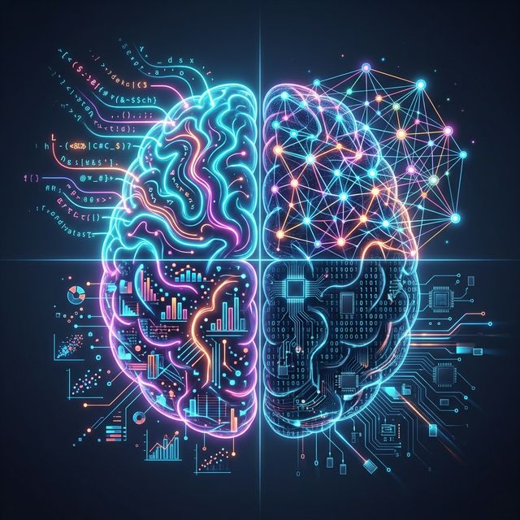

  
  
<i><b>"Synthesizing intelligence across the four quadrants of modern machine learning."</b></i>

# Hi there, I'm Harsh👋

  

---

### 🧠 The AI Mind: 4 Core Pillars

| Quadrant | Domain | Key Technology |
| :--- | :--- | :--- |
| **I. Linguistic Intelligence** | NLP, RAG, and LLM Logic | LangChain, HuggingFace, SpaCy |
| **II. Neural Architecture** | Machine Learning & Deep Learning | PyTorch, Scikit-learn, FAISS |
| **III. Analytical Insight** | Business Intelligence & Data Science | Power BI, DAX, Time Series |
| **IV. Operational Logic** | Fullstack AI & Scalable Systems | React, Node.js, Streamlit |

---

### 👨‍💻 About Me

I am an **AI + ML Engineer** passionate about bridging the gap between raw data and actionable AI insights. My expertise lies in building advanced **RAG (Retrieval-Augmented Generation)** systems, semantic search architectures, and high-impact data visualizations.

- 🔭 **Currently focusing on**: Large Language Models (LLMs) and Vector Databases.
- 🌱 **Deepening my knowledge**: Multi-hop reasoning and hybrid search techniques.
- ⚡ **Philosophy**: "Code_pharma — Transforming complex data into simple, powerful code."
- 🏢 **Professional background**: Engineering robust solutions with Python, LangChain, and Power BI.

---

### 🛠️ Tech Stack & Tools

**Languages & Frameworks:**

  

**AI/ML & Data Engineering Highlights:**
- **Frameworks:** LangChain, HuggingFace Transformers, Streamlit, Scikit-learn, FAISS.
- **NLP:** SpaCy, NLTK, Semantic Search, RAG Architectures.
- **BI & Analytics:** Power BI (DAX/M), Advanced Excel, Time Series Forecasting.

---

### 📊 GitHub Statistics

  
  

  

  

---

### 🚀 Highlighted Projects

| Project | Description | Tech Stack |
| :--- | :--- | :--- |
| **[📄 PDF-RAG-BOT](https://github.com/makers10/PDF-RAG-BOT)** | Advanced RAG system with Hybrid Search & Multi-hop reasoning. | LangChain, FAISS, SpaCy |
| **[📊 HR Analytics Dashboard](https://github.com/makers10/PowerBi_dashboard_HR_Analytics)** | Data-driven dashboard for attrition & performance analysis. | Power BI, DAX, M |
| **[🔤 WordWise AI](https://github.com/makers10/wordwise_-ai-word-analyzer)** | AI-driven linguistic tool for deep word analysis. | TypeScript, React, NLP |
| **[🔑 LLM-Tester](https://github.com/makers10/LLM-API-KEY-TESTER)** | Specialized utility for validating and testing LLM API keys. | Python, AI Utilities |

---

### 📫 Connect with Me

  
  
  <!-- Add your LinkedIn below if you have one -->
  <!--  -->

---

  <i>"I build things that bridge the gap between humans and machine intelligence."</i> 
  <b>Harsh@</b> - 2026

